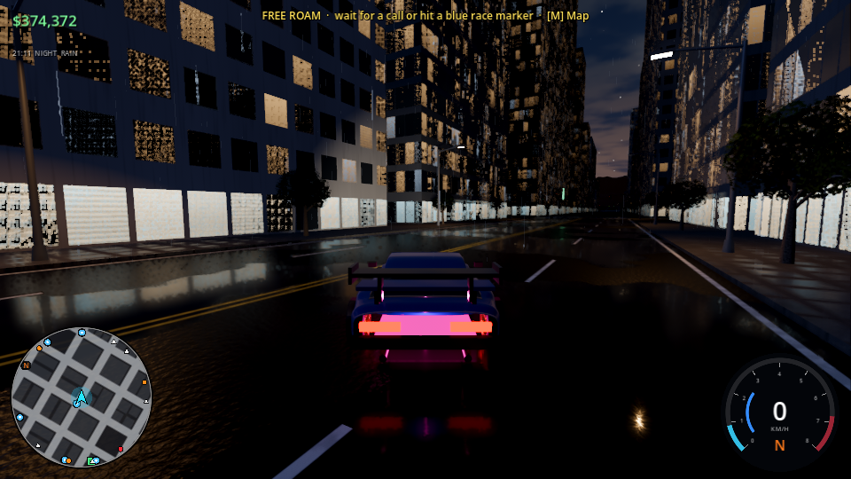
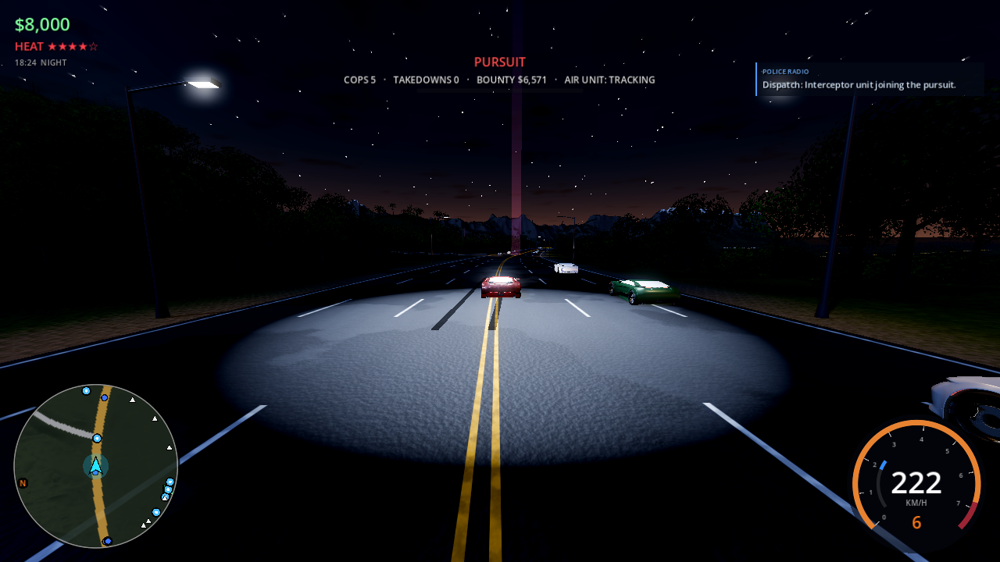
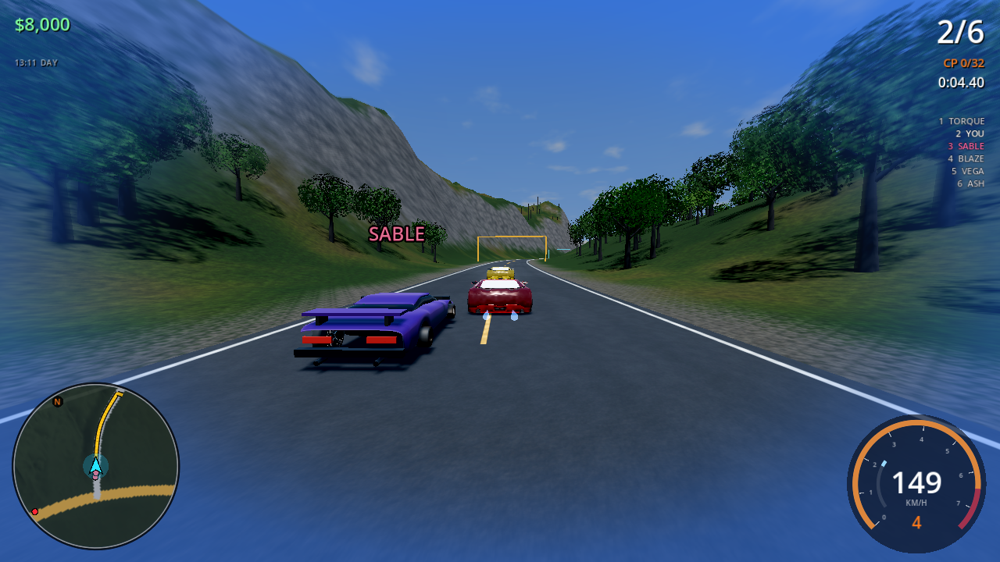
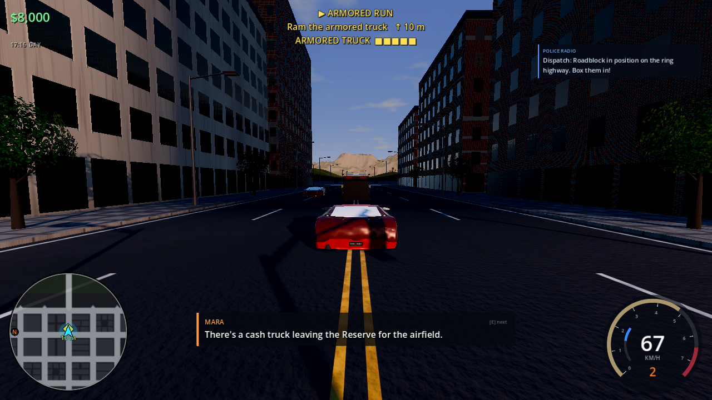
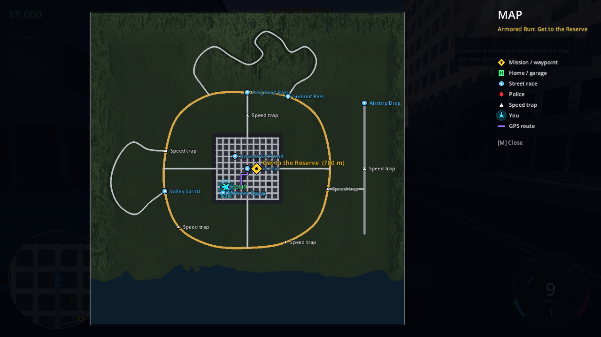
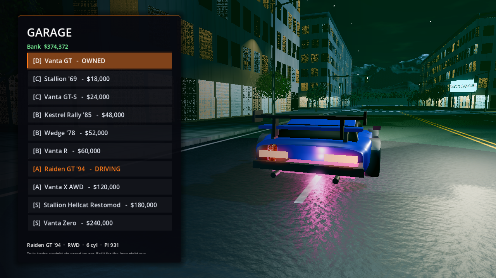
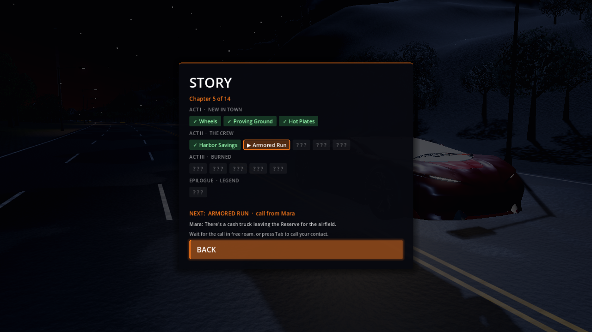

# Velocity Heat

Open-world getaway-driving game built with **Godot 4.7**. You're a driver for hire in Solano Bay. Chill at your garage, cruise the city, and when the phone rings, take the contract: bank-job getaways, armored-truck takedowns, hot deliveries, boss races and police escapes. The cops are always ready to chase.




| | |
|---|---|
|  |  |
|  |  |
|  |  |

| | |
|---|---|
|  |  |
|  |  |

| | |
|---|---|
|  |  |

*Screenshots are from development builds rendered with a software GPU; real hardware looks better.*

## Features

- **Story campaign - 14 chapters in 3 acts.** Arrive in Solano Bay with one car and a reputation. Work for Mara, the city's best fixer, and Dex, her mechanic. Take on Sable and his Night Kings street crew, and survive Lieutenant Kane's Heat Task Force. Contracts come in as phone calls, told through subtitled dialogue with colour-coded speakers. Mission types:
  - bank-job getaways
  - timed deliveries
  - armored-truck takedowns
  - boss races against named rivals
  - an ambush escape
  - running down a traitor
  - a final heist on the Federal Reserve

  Between and after story jobs: side jobs, 7 street races, 6 speed traps, 3 drift zones (each tracks your best) and 20 hidden billboards to smash.
- **Legendary police pursuits** with 5 heat levels:
  - patrols and dispatch radio chatter that names where you are and which way you're heading
  - reinforcements that cut you off from ahead, PIT rams, and roadblocks you can smash through
  - elite interceptors and **Air One**, a helicopter with a searchlight. Lose it between downtown skyscrapers, or outlast its fuel.
  - **Lt. Kane** in her own interceptor during the finale

  Ram cops while you're the faster car to take them down for bounty. Only buildings can stop your car; everything else gets knocked aside.
- **Handling that grips by default.** Cars stay planted, with traction control and stability control (both toggleable). Drifts only start when you throw the car in with the handbrake, then they're easy to hold. Raycast suspension, slip-angle tyres, load transfer, anti-roll bars, aero downforce, an auto or manual gearbox, burnouts and donuts, and wheelspin on powerful cars.
- **Cars**:
  - modern Vanta builds (realistic scanned-quality model)
  - procedural classics: Stallion '69 muscle, Kestrel Rally '85 (AWD turbo hatch), Wedge '78, Raiden GT '94 (twin-turbo coupe) and a 900 hp Stallion restomod
  - higher tiers unlock as the story progresses (C after chapter 1, B after 3, A after 6, S after 9)
  - **9 upgrade categories** up to 5 levels; a fully built Vanta Zero does 0-100 km/h in about 1 second and tops out around 500 km/h

  The garage has stat bars, paint, rim finishes (chrome, gold, black, gunmetal, bronze), neon underglow and studio lighting. Aero upgrades add visible rear wings, and turbo upgrades add whistle and blow-off sounds.
- **6 × 6 km open world**:
  - downtown grid with skyscrapers and tree-lined streets
  - coastal highway ring
  - mountain hairpin pass with snowy peaks
  - valley road and an airfield drag strip
  - ~100k trees and 1,800 street lights
- **Navigation**: a full-screen map (M / View / Touchpad) where you can pin your own waypoint (click or stick + A), showing you, your mission, races, home, cops and speed traps, plus a minimap with a GPS route and a mission marker on the rim with distance. The objective banner shows a direction arrow and distance.
- **Atmosphere**: dynamic day/night, rain with wet reflective roads, tyre spray and thunderstorms, volumetric fog, procedural sky/clouds/stars, neon city nights. Speed blur and camera shake can be adjusted. Time of day (dynamic, day, dusk or night) and weather (dynamic, clear or rain) can be locked in Settings.
- **Original synthwave soundtrack**: three free-roam tracks that rotate like a radio (with a now-playing card), plus a pursuit theme, a race theme, a garage theme and an end-credits song. Music crossfades as the action changes and ducks in the pause menu. The tracks are synthesized by `tools/music/gen_music.py`.
- **Extras**: Easy/Normal/Hard difficulty, 16 achievements, a Records screen, Photo Mode (pause menu: free camera, saves PNGs to your user folder), one-time tips for new players, end credits.
- **Controller first**: full gamepad support for driving and menus, PlayStation/Xbox button prompts, analog triggers, rumble (engine, slip, ABS, impacts, landings). Every action can be remapped on keyboard and controller (Controls → Remap).
- **Graphics settings stay exactly as you set them** - no dynamic scaling:
  - Low uses the OpenGL renderer for laptops.
  - Ultra enables SDFGI global illumination, SSR, SSIL, volumetric fog, 8K shadows and dense grass.

## Build it yourself

1. Install **Godot 4.7** (standard build) and its **export templates** (Editor → Manage Export Templates → Download).
2. Clone this repo.
3. Linux executable:
   ```bash
   mkdir -p build/linux
   godot --headless --path . --export-release "Linux" build/linux/VelocityHeat.x86_64
   ./build/linux/VelocityHeat.x86_64
   ```
   Windows: `mkdir -p build/windows` then `godot --headless --path . --export-release "Windows" build/windows/VelocityHeat.exe` (a single self-contained .exe)
   (Export templates must match your Godot version exactly, e.g. 4.7.2.)
4. Or just open the project in the Godot editor and press **F5**.

World data and audio are pre-baked in `assets/`. To regenerate them: `node bake/bake_world.mjs` and `node bake/bake_audio.mjs` (Node 18+).

## Controls

| Action | Keyboard | Controller |
|---|---|---|
| Throttle / Brake-Reverse | W / S | RT / LT |
| Steer | A / D | Left stick |
| Handbrake (start a drift) | Space | X / Square |
| Nitrous | Shift | A / Cross |
| Burnout | W + S stopped | RT + LT |
| Camera / Look back | C / B | Y / R3 |
| Answer / make a call | Tab | D-pad ↓ |
| Full map | M | View / Touchpad |
| Start race / Garage / next dialogue line | E | D-pad ↑ |
| Horn | H | D-pad ← |
| Reset to road | R | Hold B / Circle |
| Pause | Esc | Start |

## Credits

- Engine: [Godot Engine](https://godotengine.org) (MIT).
- Car model: "Car Concept" by Eric Chadwick / Darmstadt Graphics Group GmbH, from the [Khronos glTF Sample Assets](https://github.com/KhronosGroup/glTF-Sample-Assets), licensed **CC BY 4.0**. The model carries Khronos logo textures; replace them before any commercial release.
- Everything else (world, textures, sounds, music) is procedurally generated by this project.
