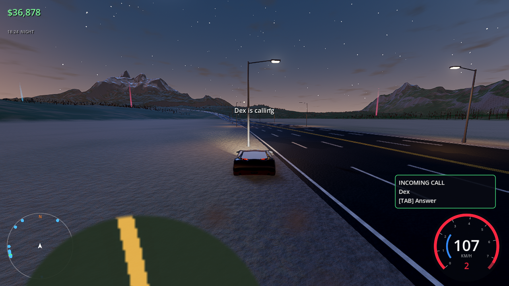
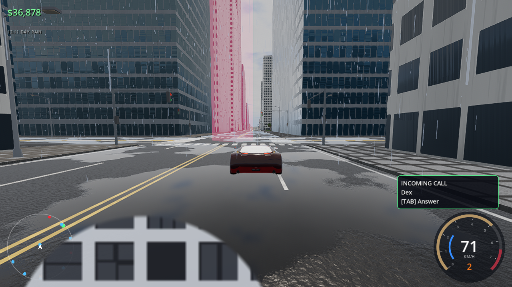
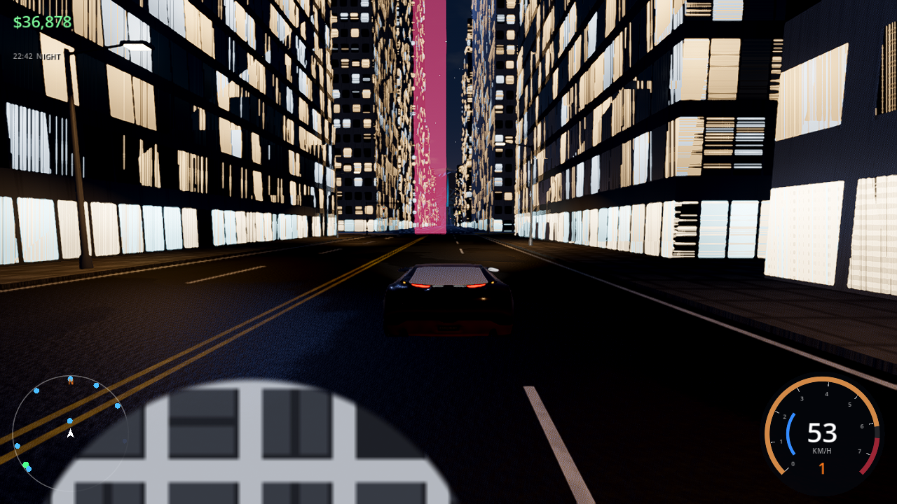
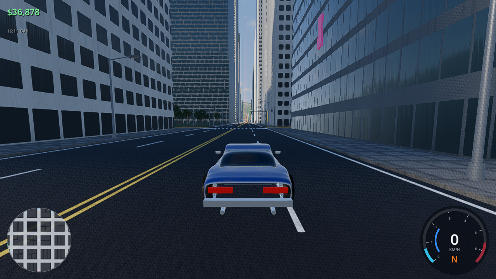
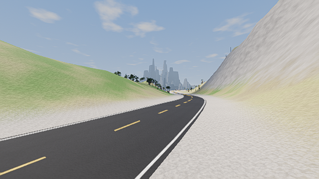
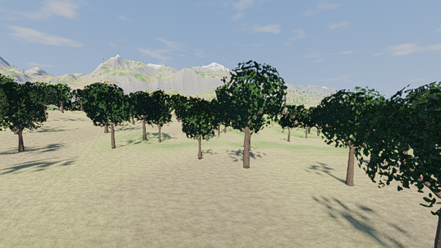
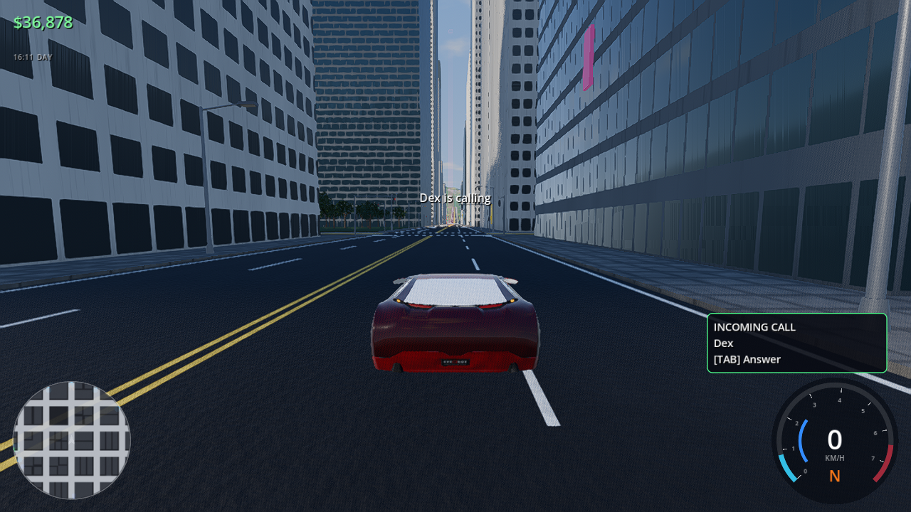

# Velocity Heat

Open-world getaway-driving game built with **Godot 4.7**. You're a driver for hire: chill at your garage, cruise the city, and when the phone rings, take the contract — bank-job getaways, hot deliveries, police escapes and street races. The cops are always ready to chase.



| | |
|---|---|
|  |  |
|  |  |
|  |  |

*Screenshots are from development builds rendered with a software GPU; real hardware looks better.*

## Features

- **6 × 6 km open world**: downtown grid with skyscrapers, coastal highway ring, mountain hairpin pass with snow peaks, valley road, airfield drag strip, ~100k trees, 1,800 street lights.
- **Tyre-model physics**: raycast suspension, slip-angle tyres, load transfer, anti-roll bars, aero downforce, gearbox (auto/manual), traction/stability control (toggleable): cars grip by default and only drift when you throw them in with the handbrake, burnouts & donuts, wheelspin on powerful cars.
- **Cars**: modern Vanta builds (realistic scanned-quality model) and procedural classics (Stallion '69 muscle, Wedge '78, 900 hp Stallion restomod). **9 upgrade categories** up to 5 levels — fully built hypercars are tuned to reach roughly 500+ km/h (still being balanced).
- **Career**: phone-call contracts from your fixer, bank heists, deliveries, escapes, races, plus repeatable random jobs, street-race events and speed traps.
- **Police**: patrols, pursuits with 5 heat levels, reinforcements, cooldown/evasion, bounties. Only buildings can stop your car — everything else gets knocked aside.
- **Atmosphere**: dynamic day/night, rain with wet reflective roads, volumetric fog, procedural sky/clouds/stars, neon city nights.
- **Controller first**: full gamepad support for driving and menus, analog triggers, rumble.
- **Scales from laptops to high-end GPUs**: Low preset uses the OpenGL renderer; Ultra enables SDFGI global illumination, SSR, SSIL, volumetric fog, 8K shadows and dense grass.

## Build it yourself

1. Install **Godot 4.7** (standard build) and its **export templates** (Editor → Manage Export Templates → Download).
2. Clone this repo.
3. Linux executable:
   ```bash
   mkdir -p build/linux
   godot --headless --path . --export-release "Linux" build/linux/VelocityHeat.x86_64
   ./build/linux/VelocityHeat.x86_64
   ```
   Windows: `mkdir -p build/windows` then `godot --headless --path . --export-release "Windows" build/windows/VelocityHeat.exe`
   (Export templates must match your Godot version exactly, e.g. 4.7.2.)
4. Or just open the project in the Godot editor and press **F5**.

World data and audio are pre-baked in `assets/`. To regenerate them: `node bake/bake_world.mjs` and `node bake/bake_audio.mjs` (Node 18+).

## Controls

| Action | Keyboard | Controller |
|---|---|---|
| Throttle / Brake-Reverse | W / S | RT / LT |
| Steer | A / D | Left stick |
| Handbrake (start a drift) | Space | X / Square |
| Nitrous | Shift | A / Cross |
| Burnout | W + S stopped | RT + LT |
| Camera / Look back | C / B | Y / R3 |
| Answer phone | Tab | D-pad ↓ |
| Full map | M | View / Touchpad |
| Start race / Garage | E | D-pad ↑ |
| Reset to road | R | Hold B / Circle |
| Pause | Esc | Start |

## Credits

- Engine: [Godot Engine](https://godotengine.org) (MIT).
- Car model: "Car Concept" by Eric Chadwick / Darmstadt Graphics Group GmbH, from the [Khronos glTF Sample Assets](https://github.com/KhronosGroup/glTF-Sample-Assets), licensed **CC BY 4.0**. The model carries Khronos logo textures; replace them before any commercial release.
- Everything else (world, textures, sounds, music) is procedurally generated by this project.
